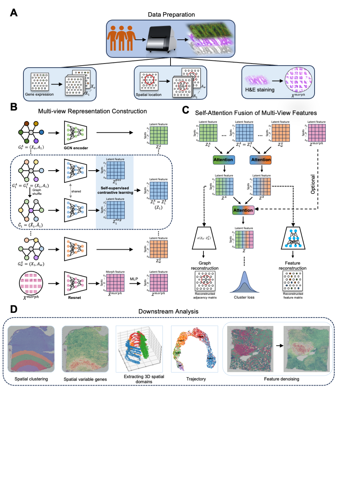

<h1>
MCGAE Tutorial
</h1>

  <a href="https://yiwen-yang.github.io/MCGAE/">MCGAE tutorial</a>

MCGAE is a novel deep computational framework designed for comprehensive analysis of spatial transcriptomics data across platforms, integrating morphological images.

Hardware Specifications
Processor: Intel Core i9-12900K @ 3.20 GHz
Memory: 64 GB RAM
GPU: NVIDIA GeForce RTX 3060
Our method has been tested and is compatible with both Windows and Linux operating systems.

  

