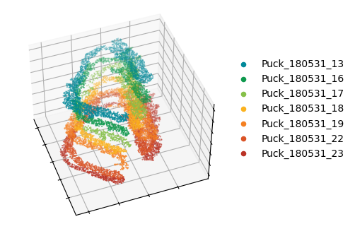
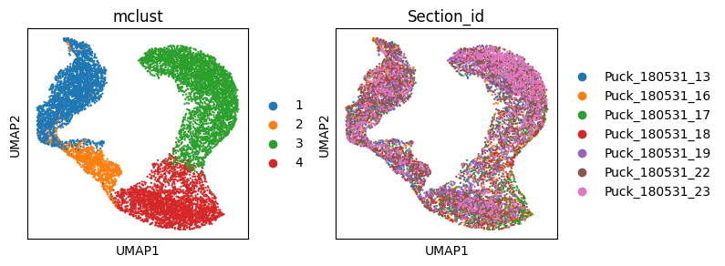
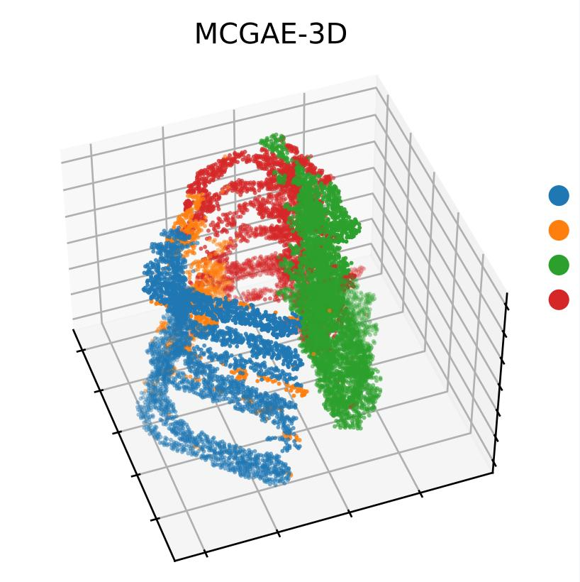

# Tutorial 2: MCGAE constructs 3D spatial domains to mitigate batch effects


## Load library
```python
import os
import pandas as pd
import scanpy as sc
import numpy as np
import torch
import torch.optim as optim
import torch.nn as nn
import time
import warnings
import matplotlib.pyplot as plt
from sklearn import metrics
from sklearn.metrics.cluster import normalized_mutual_info_score as nmi_score
from sklearn.metrics import adjusted_rand_score as ari_score
from sklearn.cluster import KMeans
import itertools
from MCGAE.model import MCGAE
from MCGAE.utils import load_dataset, norm_and_filter, compute_adata_components, mclust_R, search_res, refine_label, \
    set_seed
from MCGAE.utils import Cal_Spatial_Net_3D

```

    

## Set R kernel path
```python
os.environ['R_HOME'] = r'D:\Software\R-4.3.1'
# the location of R (used for the mclust clustering)
os.environ['R_USER'] = r'D:\Software\Anaconda\envs\py3.9\Lib\site-packages\rpy2'
```

## Prepare file path
```python
"""
BASE_DIR: Project directory
data_dir: Data directory
result_dir: Result directory
file_path: File path
"""
BASE_DIR = r"D:\Work\MCGAE project\MCGAE-master"
file_path = os.path.join(BASE_DIR, "benchmark", "3D hippocampus")

counts = pd.read_csv(os.path.join(file_path, "raw_data", "3D_Hippo_expression.txt"), sep="\t",
                     index_col=0)
position = pd.read_csv(os.path.join(file_path, "raw_data", "ICP_Align_Coor.txt"), sep="\t", index_col=0)
adata = sc.AnnData(counts)
sc.pp.highly_variable_genes(adata, flavor="seurat_v3", n_top_genes=3000)
sc.pp.normalize_total(adata, target_sum=1e4)
sc.pp.log1p(adata)
```

## read data and normalization
```python
# loading metadata and aligned coordinates
adata.obs['X'] = position.loc[adata.obs_names, 'X']
adata.obs['Y'] = position.loc[adata.obs_names, 'Y']
adata.obs['Z'] = position.loc[adata.obs_names, 'Z']
adata.obs['Section_id'] = position.loc[adata.obs_names, 'Section']
```

## Provide color for each sample
```python
# loading the spatial locations
adata.obsm['spatial'] = adata.obs.loc[:, ['X', 'Y']].values
section_colors = ['#02899A', '#0E994D', '#86C049', '#FBB21F', '#F48022', '#DA5326', '#BA3326']
```

## Set up the canvas and view the initial sample distribution
```python
fig = plt.figure(figsize=(4, 4))
ax1 = plt.axes(projection='3d')
for it, label in enumerate(np.unique(adata.obs['Section_id'])):
    temp_Coor = adata.obs.loc[adata.obs['Section_id'] == label, :]
    temp_xd = temp_Coor['X']
    temp_yd = temp_Coor['Y']
    temp_zd = temp_Coor['Z']
    ax1.scatter3D(temp_xd, temp_yd, temp_zd, c=section_colors[it], s=0.2, marker="o", label=label)

ax1.set_xlabel('')
ax1.set_ylabel('')
ax1.set_zlabel('')

ax1.set_xticklabels([])
ax1.set_yticklabels([])
ax1.set_zticklabels([])

plt.legend(bbox_to_anchor=(1, 0.8), markerscale=10, frameon=False)

ax1.elev = 45
ax1.azim = -20

plt.show()
```



    


## Computes multiple view components and calculates neighbor relationships between adjacent samples
```python
set_seed(1234)
compute_adata_components(adata, n_components=100)
# construct 3D
Cal_Spatial_Net_3D(adata, key_section='Section_id', num=32, p=0.2)
adata.obsm["adj_orig"] = adata.obsm["combined_adjacency_KNN"]
adata.obsm["adj_aug"] = adata.obsm["combined_adjacency_cosine"]
adata.obsm["graph_orig"] = adata.obsm["graph_knn"]

```

    Graph constructed!
    For denoise data training: Epoch [0/100], Loss: 0.0018
    For denoise data training: Epoch [10/100], Loss: 0.0009
    For denoise data training: Epoch [20/100], Loss: 0.0009
    For denoise data training: Epoch [30/100], Loss: 0.0009
    For denoise data training: Epoch [40/100], Loss: 0.0009
    For denoise data training: Epoch [50/100], Loss: 0.0009
    For denoise data training: Epoch [60/100], Loss: 0.0009
    For denoise data training: Epoch [70/100], Loss: 0.0009
    For denoise data training: Epoch [80/100], Loss: 0.0009
    For denoise data training: Epoch [90/100], Loss: 0.0009
    Graph_hat constructed!
    Run 1: l [0.01, 1000], p [0.0, 2687.040892295065]
    Run 2: l [0.01, 500.005], p [0.0, 1327.6409912109375]
    Run 3: l [0.01, 250.0075], p [0.0, 569.8638916015625]
    Run 4: l [0.01, 125.00874999999999], p [0.0, 223.31988525390625]
    Run 5: l [0.01, 62.509375], p [0.0, 72.82575225830078]
    Run 6: l [0.01, 31.2596875], p [0.0, 20.441387176513672]
    Run 7: l [0.01, 15.63484375], p [0.0, 5.05623722076416]
    Run 8: l [0.01, 7.822421875], p [0.0, 0.9642606973648071]
    Run 9: l [3.9162109375, 7.822421875], p [0.17983782291412354, 0.9642606973648071]
    Run 10: l [3.9162109375, 5.86931640625], p [0.17983782291412354, 0.44789183139801025]
    Run 11: l [3.9162109375, 4.8927636718750005], p [0.17983782291412354, 0.28901946544647217]
    Run 12: l [3.9162109375, 4.4044873046875], p [0.17983782291412354, 0.22960197925567627]
    recommended l =  4.16034912109375
    combined_adjacency_gaussian constructed!
    combined_adjacency_KNN constructed!
    combined_adjacency_cosine constructed!
    multi view Combined adjacency matrix constructed!
    

## Train model
```python
model = MCGAE(
        adata,
        n_latent=50,
        n_components=100,
        use_pca=True,
        fusion_mode="fractional",
        use_emb_x_rec=True,
        use_emb_g_rec=True,
        dropout=0.01,
        random_seed=8,
    )

model.train(weight_decay=5e-4,
                max_epochs=600,
                w_recon_x=0.05,
                w_recon_g=0.01,
                w_contrast=0.01,
                w_cluster=0.1,
                cl_start_epoch=100,
                n_clusters=4,
                compute_g_loss="cross_entropy",
                adj_diag=1,
                cluster_method="kmeans",
                )
```

    Initializing cluster centers with kmeans, n_clusters known
    

    training:   0%|▏                                                                       | 2/600 [00:00<01:44,  5.72it/s]

    Epoch: 0, Loss: 0.46930643916130066
    

    training:   4%|██▌                                                                    | 22/600 [00:03<01:30,  6.37it/s]

    Epoch: 20, Loss: 0.4749948978424072
    

    training:   7%|████▉                                                                  | 42/600 [00:06<01:20,  6.94it/s]

    Epoch: 40, Loss: 0.4679427742958069
    

    training:  10%|███████▎                                                               | 62/600 [00:09<01:16,  7.04it/s]

    Epoch: 60, Loss: 0.45564910769462585
    

    training:  14%|█████████▋                                                             | 82/600 [00:12<01:13,  7.01it/s]

    Epoch: 80, Loss: 0.4409998059272766
    

    training:  17%|███████████▉                                                          | 102/600 [00:14<01:10,  7.04it/s]

    Epoch: 100, Loss: 0.43004512786865234
    

    training:  20%|██████████████▏                                                       | 122/600 [00:17<01:08,  7.00it/s]

    Epoch: 120, Loss: 0.42057886719703674
    

    training:  24%|████████████████▌                                                     | 142/600 [00:20<01:06,  6.93it/s]

    Epoch: 140, Loss: 0.41338834166526794
    

    training:  27%|██████████████████▉                                                   | 162/600 [00:23<01:03,  6.88it/s]

    Epoch: 160, Loss: 0.4078400135040283
    

    training:  30%|█████████████████████▏                                                | 182/600 [00:26<01:00,  6.91it/s]

    Epoch: 180, Loss: 0.40357333421707153
    

    training:  34%|███████████████████████▌                                              | 202/600 [00:29<00:58,  6.78it/s]

    Epoch: 200, Loss: 0.4002784788608551
    

    training:  37%|█████████████████████████▉                                            | 222/600 [00:32<00:55,  6.78it/s]

    Epoch: 220, Loss: 0.3975831866264343
    

    training:  40%|████████████████████████████▏                                         | 242/600 [00:35<00:50,  7.07it/s]

    Epoch: 240, Loss: 0.3953728675842285
    

    training:  44%|██████████████████████████████▌                                       | 262/600 [00:38<00:47,  7.06it/s]

    Epoch: 260, Loss: 0.39355236291885376
    

    training:  47%|████████████████████████████████▉                                     | 282/600 [00:41<00:45,  7.05it/s]

    Epoch: 280, Loss: 0.39198607206344604
    

    training:  50%|███████████████████████████████████▏                                  | 302/600 [00:43<00:42,  6.95it/s]

    Epoch: 300, Loss: 0.39062654972076416
    

    training:  54%|█████████████████████████████████████▌                                | 322/600 [00:46<00:43,  6.40it/s]

    Epoch: 320, Loss: 0.38944587111473083
    

    training:  57%|███████████████████████████████████████▉                              | 342/600 [00:49<00:39,  6.61it/s]

    Epoch: 340, Loss: 0.3884800672531128
    

    training:  60%|██████████████████████████████████████████▏                           | 362/600 [00:52<00:34,  6.85it/s]

    Epoch: 360, Loss: 0.3876018226146698
    

    training:  64%|████████████████████████████████████████████▌                         | 382/600 [00:55<00:31,  6.83it/s]

    Epoch: 380, Loss: 0.38675832748413086
    

    training:  67%|██████████████████████████████████████████████▉                       | 402/600 [00:58<00:28,  6.90it/s]

    Epoch: 400, Loss: 0.3859403133392334
    

    training:  67%|██████████████████████████████████████████████▉                       | 402/600 [00:58<00:28,  6.85it/s]

    delta_label 0.0 < tol 1e-06
    Reach tolerance threshold. Stopping training.
    Total epoch: 402
    

    
    

## Analysis of model calculation results
```python
    temp = model.get_model_output()
    emb, y_pred, emb_rec = temp["emb"], temp["y_pred"], temp["x_rec"]
    adata.obsm["z"] = emb
    adata.obs["y_pred"] = y_pred
    sc.pp.neighbors(adata, use_rep="z")
    sc.tl.umap(adata)
    num_cluster = 4
    adata = mclust_R(adata, num_cluster, used_obsm='z')
    adata.obs['mclust'] = adata.obs['mclust'].astype('str')
    # sc.tl.leiden(adata, resolution=0.05)
    plt.rcParams["figure.figsize"] = (3, 3)
    sc.pl.umap(adata, color=['mclust', 'Section_id'], show=False)
    fig = plt.figure(figsize=(4, 4))
    ax1 = plt.axes(projection='3d')
    for it, label in enumerate(np.unique(adata.obs['mclust'])):
        temp_Coor = adata.obs.loc[adata.obs['mclust'] == label, :]
        temp_xd = temp_Coor['X']
        temp_yd = temp_Coor['Y']
        temp_zd = temp_Coor['Z']
        ax1.scatter3D(temp_xd, temp_yd, temp_zd, c=adata.uns['mclust_colors'][it], s=30, marker="o", label=label)

    ax1.set_xlabel('')
    ax1.set_ylabel('')
    ax1.set_zlabel('')

    ax1.set_xticklabels([])
    ax1.set_yticklabels([])
    ax1.set_zticklabels([])

    plt.legend(bbox_to_anchor=(1.2, 0.8), markerscale=1, frameon=False)
    plt.title('MCGAE-3D')
    ax1.view_init(elev=0, azim=0)
    ax1.elev = 45
    ax1.azim = -20
    plt.show()
```

    R[write to console]:                    __           __ 
       ____ ___  _____/ /_  _______/ /_
      / __ `__ \/ ___/ / / / / ___/ __/
     / / / / / / /__/ / /_/ (__  ) /_  
    /_/ /_/ /_/\___/_/\__,_/____/\__/   version 6.0.1
    Type 'citation("mclust")' for citing this R package in publications.
    
    

    fitting ...
      |======================================================================| 100%
      


  

