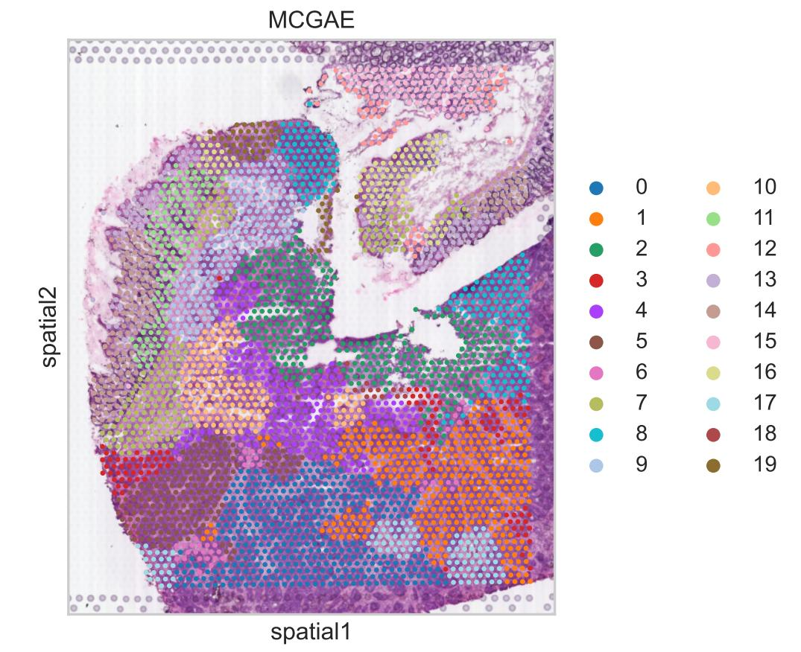

# Tutorial 2: MCGAE's spatial clustering of colorectal cancer liver metastasis data elucidated the phenomenon of tumor invasion

## Load library
```python
import os
import pandas as pd
import scanpy as sc
import torch
import torch.optim as optim
import torch.nn as nn
import warnings
import matplotlib.pyplot as plt
from sklearn import metrics
from sklearn.metrics.cluster import normalized_mutual_info_score as nmi_score
from sklearn.metrics import adjusted_rand_score as ari_score
from sklearn.cluster import KMeans
import itertools
from MCGAE.model import MCGAE
from MCGAE.utils import load_dataset, norm_and_filter, compute_adata_components, search_res, refine_label, set_seed, \
    Moran_I

# Suppressing runtime warnings
warnings.filterwarnings("ignore", category=RuntimeWarning)
```
    

## Prepare file path
```python
"""
BASE_DIR: Project directory
data_dir: Data directory
result_dir: Result directory
file_path: File path
"""
file_name = "ST-colon1"

BASE_DIR = r"D:\Work\MCGAE project\MCGAE-master"
file_path = os.path.join(BASE_DIR, "benchmark", "Colorectal Cancer", f"{file_name}")
dir_path = os.path.join(file_path, "raw_data")
```

## Extract image information
``` python 
adata = load_dataset(dir_path, use_image=True)
sc.pp.filter_genes(adata, min_cells=1)
sc.pp.highly_variable_genes(adata, flavor="seurat_v3", n_top_genes=3000)
sc.pp.normalize_total(adata, target_sum=1e4)
sc.pp.log1p(adata)
adata = adata[:, adata.var["highly_variable"]]
n_clusters = 20
print(n_clusters)
```


    Tiling image: 100%|███████████████████████████████████████████████████████████████████████████████ [ time left: 00:00 ]
    Extract feature: 100%|████████████████████████████████████████████████████████████████████████████ [ time left: 00:00 ]
    

    The morphology feature is added to adata.obsm['X_morphology']!
    20
    Graph constructed!
    

    adata.obsm["graph_orig"] = interaction
   

##  Compute multiple view components
```python
set_seed(1234)
compute_adata_components(adata, n_components=100)
save_obj_z = pd.DataFrame()
``` 

    For denoise data training: Epoch [0/100], Loss: 0.0041
    For denoise data training: Epoch [10/100], Loss: 0.0006
    For denoise data training: Epoch [20/100], Loss: 0.0006
    For denoise data training: Epoch [30/100], Loss: 0.0006
    For denoise data training: Epoch [40/100], Loss: 0.0006
    For denoise data training: Epoch [50/100], Loss: 0.0006
    For denoise data training: Epoch [60/100], Loss: 0.0006
    For denoise data training: Epoch [70/100], Loss: 0.0006
    For denoise data training: Epoch [80/100], Loss: 0.0006
    For denoise data training: Epoch [90/100], Loss: 0.0006
    Graph_hat constructed!
    

## Train model
```python
model = MCGAE(
    adata,
    n_latent=50,
    n_components=100,
    use_pca=True,
    # fusion_mode="holistic",
    fusion_mode="fractional",
    # fusion_mode="vanilla",
    use_emb_x_rec=True,
    use_emb_g_rec=True,
    dropout=0.01,  # 0.01
    random_seed=12,
    w_morph=1.9,
)

model.train(
    weight_decay=5e-4,
    # weight_decay=0.0,
    w_recon_x=0.05,
    w_recon_g=0.1,
    w_contrast=0.1,
    w_cluster=0.1,
    n_clusters=n_clusters,
    cl_start_epoch=100,
    compute_g_loss="cross_entropy",
)
```

    Now the cycle is: 12
    Searching resolution...    

    training:   2%|█▎                                                                      | 7/400 [00:00<00:17, 22.04it/s]

    Epoch: 0, Loss: 2.7255704402923584
    

    training:   8%|█████▌                                                                 | 31/400 [00:00<00:07, 50.33it/s]

    Epoch: 20, Loss: 1.2939739227294922
    

    training:  12%|████████▉                                                              | 50/400 [00:01<00:06, 55.35it/s]

    Epoch: 40, Loss: 0.9415194988250732
    

    training:  17%|████████████▏                                                          | 69/400 [00:01<00:05, 56.74it/s]

    Epoch: 60, Loss: 0.7995103001594543
    

    training:  22%|███████████████▍                                                       | 87/400 [00:01<00:05, 57.74it/s]

    Epoch: 80, Loss: 0.7482431530952454
    

    training:  28%|███████████████████▌                                                  | 112/400 [00:02<00:04, 58.68it/s]

    Epoch: 100, Loss: 0.7114622592926025
    

    training:  32%|██████████████████████▊                                               | 130/400 [00:02<00:04, 58.09it/s]

    Epoch: 120, Loss: 0.6843234300613403
    

    training:  37%|██████████████████████████                                            | 149/400 [00:02<00:04, 58.12it/s]

    Epoch: 140, Loss: 0.6560841202735901
    

    training:  43%|██████████████████████████████▎                                       | 173/400 [00:03<00:03, 57.56it/s]

    Epoch: 160, Loss: 0.6310422420501709
    

    training:  48%|█████████████████████████████████▍                                    | 191/400 [00:03<00:03, 57.97it/s]

    Epoch: 180, Loss: 0.610443115234375
    

    training:  52%|████████████████████████████████████▌                                 | 209/400 [00:03<00:03, 58.08it/s]

    Epoch: 200, Loss: 0.593916654586792
    

    training:  57%|███████████████████████████████████████▋                              | 227/400 [00:04<00:02, 57.91it/s]

    Epoch: 220, Loss: 0.5803815722465515
    

    training:  63%|███████████████████████████████████████████▉                          | 251/400 [00:04<00:02, 58.28it/s]

    Epoch: 240, Loss: 0.5691173076629639
    

    training:  67%|███████████████████████████████████████████████                       | 269/400 [00:04<00:02, 58.02it/s]

    Epoch: 260, Loss: 0.560197114944458
    

    training:  73%|███████████████████████████████████████████████████▎                  | 293/400 [00:05<00:01, 57.74it/s]

    Epoch: 280, Loss: 0.5517188310623169
    

    training:  78%|██████████████████████████████████████████████████████▍               | 311/400 [00:05<00:01, 58.08it/s]

    Epoch: 300, Loss: 0.5455691814422607
    

    training:  82%|█████████████████████████████████████████████████████████▊            | 330/400 [00:05<00:01, 58.34it/s]

    Epoch: 320, Loss: 0.5398231744766235
    

    training:  87%|████████████████████████████████████████████████████████████▉         | 348/400 [00:06<00:00, 57.37it/s]

    Epoch: 340, Loss: 0.5346991419792175
    

    training:  93%|█████████████████████████████████████████████████████████████████     | 372/400 [00:06<00:00, 58.27it/s]

    Epoch: 360, Loss: 0.5296562314033508
    

    training:  98%|████████████████████████████████████████████████████████████████████▎ | 390/400 [00:07<00:00, 58.23it/s]

    Epoch: 380, Loss: 0.5251146554946899
    

    training: 100%|██████████████████████████████████████████████████████████████████████| 400/400 [00:07<00:00, 55.49it/s]

    Epoch: 399, Loss: 0.5210220813751221
    

    
    

## Analysis of model calculation results
```python
temp = model.get_model_output()
emb, y_pred, emb_rec = temp["emb"], temp["y_pred"], temp["x_rec"]
adata.obsm["z"] = emb
adata.obs["pred"] = y_pred
res = search_res(adata, n_clusters, rep="z", start=0.3, end=3, increment=0.02)
sc.pp.neighbors(adata, use_rep="z", n_neighbors=10, random_state=1234)
sc.tl.leiden(adata, key_added="leiden", resolution=res, random_state=1234)
new_type = refine_label(adata, key='leiden', radius=30)
adata.obs['leiden'] = new_type
sc.pl.spatial(adata, img_key="hires", color='leiden', title="MCGAE")
plt.tight_layout()
```

    Searching resolution...
    

  


    <Figure size 1920x1440 with 0 Axes>


## Data expression after noise reduction

```python
sc.pp.scale(adata, zero_center=False, max_value=1)
adata2 = adata.copy()
adata2.X = emb_rec
sc.pl.spatial(adata, img_key="hires", color="TF", title="TF_raw_Exp", color_map="RdYlGn_r")
sc.pl.spatial(adata2, img_key="hires", color="TF", title="TF_denoise", color_map="RdYlGn_r")
sc.pl.spatial(adata, img_key="hires", color="ALB", title="ALB_raw_Exp", color_map="RdYlGn_r")
sc.pl.spatial(adata2, img_key="hires", color="ALB", title="ALB_denoise", color_map="RdYlGn_r")
```


<div style="text-align: center;">
  
</div>
    
    


<div style="text-align: center;">
  
</div>
    


<div style="text-align: center;">
  
</div>
    


<div style="text-align: center;">
  
</div>

